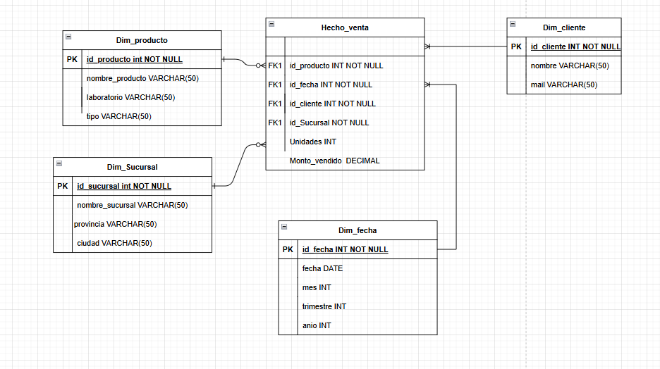
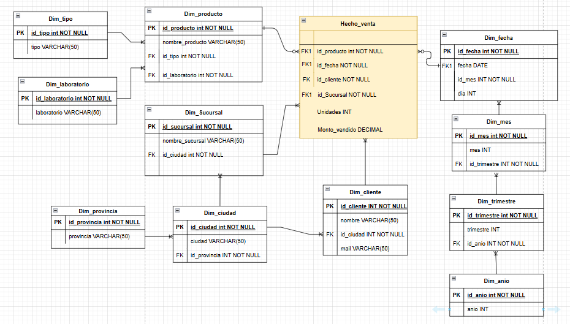

# Modelado de datawarehouse Cadena de farmacia

Consigna: Una cadena de farmacias que vende medicamentos cosméticos con sucursales en distintas provincias. Todas venden los mismos productos facilitando eventuales consolidaciones. Los productos se clasifican por laboratorio de origen y también por tipo (medicamento, cosmético, general). En todos los casos se desea conocer el total de productos vendidos por sucursal, por mes, trimestre y por año.

## Modelos implementados

### ⭐ Modelo Estrella

#### Diagrama

### ❄️ Modelo Copo de Nieve (Snowflake)
#### Diagrama

## Comparación de modelos

| Característica     | Estrella ⭐ | Snowflake ❄️ |
|------------------|------------|-------------|
| Simplicidad       | Alta       | Media       |
| Performance       | Alta       | Media       |
| Redundancia       | Mayor      | Menor       |
| Cantidad de joins | Baja       | Alta        |